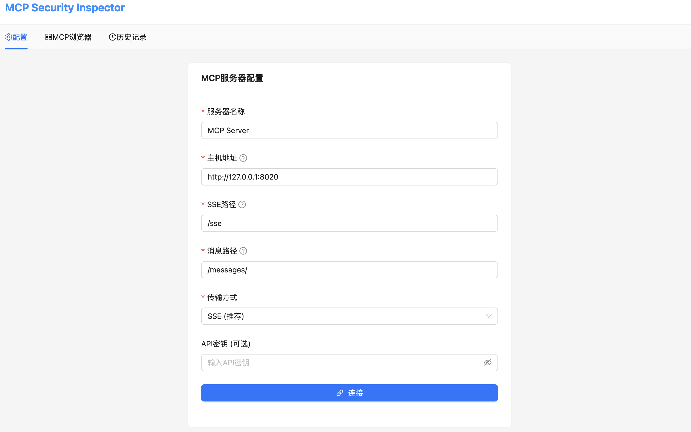
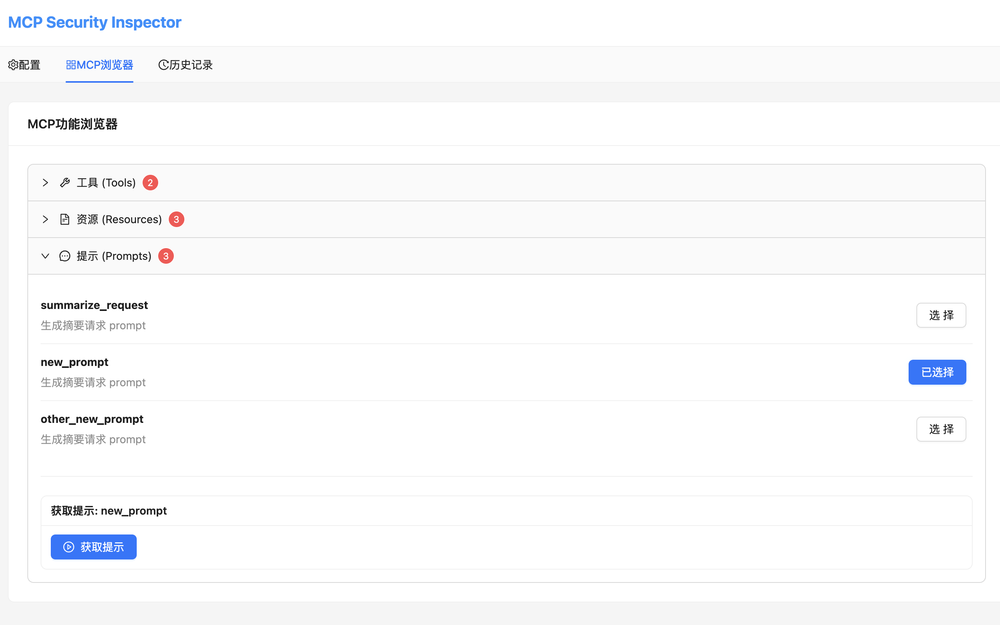
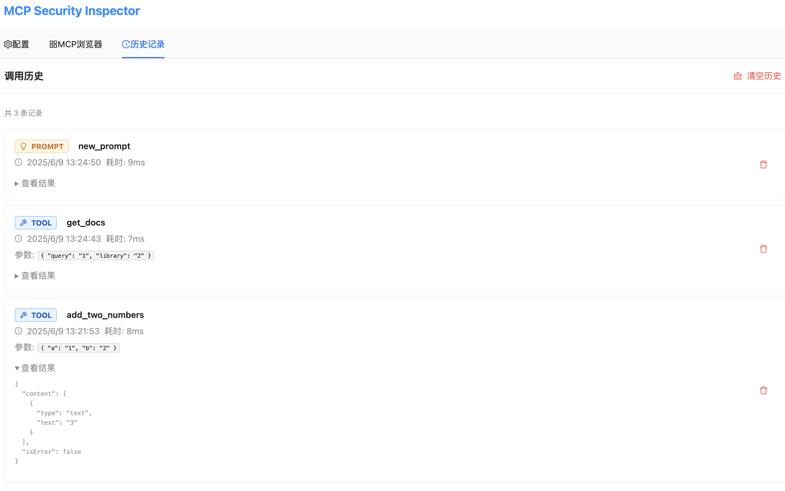

# MCP Security Inspector

一个用于检测Model Context Protocol (MCP)安全性的Chrome扩展工具。

(该项目纯cursor生成)

插件地址：https://chromewebstore.google.com/detail/mcp-security-inspector/opajbcoflmgkjmjafchlgehgllbekgeo

## 功能特性

### 🔧 核心功能
- **MCP服务器连接**: 支持SSE方式连接远程MCP服务器
- **自动发现**: 自动获取并展示MCP服务器的tools、resources、prompts
- **动态测试**: 支持选择工具并动态生成参数表单进行测试
- **结果展示**: 友好展示调用结果，支持多种内容类型
- **历史记录**: 完整记录所有调用历史，支持回溯和分析

### 📊 界面功能
- **配置面板**: 支持手动输入MCP服务器配置
- **工具面板**: 展示可用工具，支持参数配置和调用
- **资源面板**: 查看和读取MCP资源
- **提示面板**: 管理和使用MCP提示模板
- **历史面板**: 查看调用历史，支持筛选和导出

## 使用截屏
### index


### explorer


### history


## 快速开始

### 1. 安装扩展

1. **下载或构建项目**:
   ```bash
   git clone https://github.com/purpleroc/mcp-security-inspector
   cd mcp-security-inspector
   npm install
   npm run build:extension
   ```

2. **准备扩展文件**:
   ```bash
   cp public/manifest.json dist/
   cp public/background.js dist/
   cp -r public/icons dist/
   mv dist/public/index.html dist/index.html
   ```

3. **安装到Chrome**:
   - 打开Chrome浏览器
   - 访问 `chrome://extensions/`
   - 开启"开发者模式"
   - 点击"加载已解压的扩展程序"
   - 选择项目的 `dist` 文件夹

## 技术架构

### 前端技术栈
- **React 18** - 用户界面框架
- **TypeScript** - 类型安全
- **Ant Design** - UI组件库
- **Redux Toolkit** - 状态管理
- **Vite** - 构建工具

### MCP协议支持
- **JSON-RPC 2.0** - 消息格式
- **协议版本**: 2025-06-09
- **Server-Sent Events** - 实时通信
- **HTTP/HTTPS** - 标准HTTP传输
- **CORS支持** - 跨域请求处理

## 开发模式

开发时使用以下命令：

```bash
# 启动开发服务器
npm run dev

# 类型检查
npm run type-check

# 构建生产版本
npm run build:extension

# 启动测试MCP服务器
python3 test-mcp-server.py
```

## 更新日志

### v1.0.3 (当前版本)
- 本地保存历史连接服务列表
- 本地保存历史调用详情
- 增加多种认证适配，支持apikey、自定义header、basic auth、get参数

### v1.0.2
- 修复去掉host_permissions导致cors的错误
- 去掉多余配置，单纯从sse url获取

### v1.0.1
- 🆕 新标签页模式，提供更好的用户体验
- 🔧 修复HTTP 400错误，改进MCP协议兼容性
- 📱 响应式布局，适配不同屏幕尺寸
- 🧪 内置测试服务器，便于功能验证
- 🎨 改进UI设计和交互体验

### v1.0.0
- 初始版本发布
- 支持MCP协议的完整功能
- 安全检查和风险评估
- 完整的用户界面和历史记录

---

**开发者**: purpleroc
**联系方式**: [GitHub Issues](https://github.com/purpleroc/mcp-security-inspector/issues) 