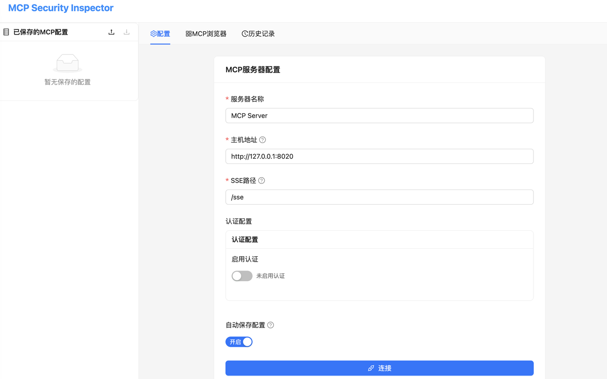

# MCP Security Inspector

一个用于检测Model Context Protocol (MCP)安全性的Chrome扩展工具。

(该项目纯cursor生成，插件正在发布中，已经被打回来几次了...)

## 功能特性

### 🔧 核心功能
- **MCP服务器连接**: 支持HTTP、SSE、Stdio等多种传输方式
- **自动发现**: 自动获取并展示MCP服务器的tools、resources、prompts
- **动态测试**: 支持选择工具并动态生成参数表单进行测试
- **结果展示**: 友好展示调用结果，支持多种内容类型
- **历史记录**: 完整记录所有调用历史，支持回溯和分析

### 📊 界面功能
- **配置面板**: 支持手动输入或从JSON文件导入MCP服务器配置
- **工具面板**: 展示可用工具，支持参数配置和调用
- **资源面板**: 查看和读取MCP资源
- **提示面板**: 管理和使用MCP提示模板
- **历史面板**: 查看调用历史，支持筛选和导出

## 使用截屏
### index


### explorer


### history


## 快速开始

### 1. 安装扩展

1. **下载或构建项目**:
   ```bash
   git clone <repository-url>
   cd mcp_inspector
   npm install
   npm run build
   ```

2. **准备扩展文件**:
   ```bash
   cp public/manifest.json dist/
   cp public/background.js dist/
   cp -r public/icons dist/
   mv dist/public/index.html dist/index.html
   ```

3. **安装到Chrome**:
   - 打开Chrome浏览器
   - 访问 `chrome://extensions/`
   - 开启"开发者模式"
   - 点击"加载已解压的扩展程序"
   - 选择项目的 `dist` 文件夹

### 2. 配置和测试

1. **点击Chrome工具栏中的扩展图标**，会在新标签页中打开MCP Security Inspector

2. **配置MCP服务器** (推荐使用分别配置方式):
   - 服务器名称: `Docs Server`
   - **分别配置** (推荐):
     - 主机地址: `http://127.0.0.1:8020`
     - SSE路径: `/sse`
     - 消息路径: `/messages/`
   - **或传统方式**:
     - 服务器端点: `http://localhost:8020/sse`
   - 传输方式: `SSE`

3. **点击"连接"**:
   - 系统会建立SSE连接，等待服务器推送endpoint信息
   - 从返回的`event: endpoint, data: /messages/?session_id=xxx`中提取session_id
   - 连接成功后会自动获取所有tools、resources、prompts数据
   - 自动切换到相应的功能页面（优先显示tools）

4. **开始测试**:
   - 在工具页面选择 `get_docs` 工具进行测试
   - 输入参数如：query="React Agent", library="langchain"
   - 查看实时的安全风险评估和建议

## 技术架构

### 前端技术栈
- **React 18** - 用户界面框架
- **TypeScript** - 类型安全
- **Ant Design** - UI组件库
- **Redux Toolkit** - 状态管理
- **Vite** - 构建工具

### MCP协议支持
- **JSON-RPC 2.0** - 消息格式
- **协议版本**: 2024-11-05
- **Server-Sent Events** - 实时通信
- **HTTP/HTTPS** - 标准HTTP传输
- **CORS支持** - 跨域请求处理

## 开发模式

开发时使用以下命令：

```bash
# 启动开发服务器
npm run dev

# 类型检查
npm run type-check

# 构建生产版本
npm run build

# 启动测试MCP服务器
python3 test-mcp-server.py
```

## 更新日志

### v1.1.0 (当前版本)
- 🆕 新标签页模式，提供更好的用户体验
- 🔧 修复HTTP 400错误，改进MCP协议兼容性
- 📱 响应式布局，适配不同屏幕尺寸
- 🧪 内置测试服务器，便于功能验证
- 🎨 改进UI设计和交互体验

### v1.0.0
- 初始版本发布
- 支持MCP协议的完整功能
- 安全检查和风险评估
- 完整的用户界面和历史记录

---

**开发者**: purpleroc
**联系方式**: [GitHub Issues](https://github.com/purpleroc/mcp-security-inspector/issues) 