# MCP Security Inspector：AI驱动的MCP协议安全检测工具

## 项目概述

MCP Security Inspector 是全球首个专为 Model Context Protocol (MCP) 服务器设计的AI增强安全检测Chrome扩展。该项目结合主动扫描和被动监控两种方式（主动扫描让用户主动发起全面安全检测，被动监控则实时监控MCP调用，自动发现潜在威胁）这种双重模式确保安全检测既全面又实时。此外，项目的最大亮点是深度集成多种LLM服务（OpenAI GPT、Claude、Gemini等），让AI直接参与测试样例的生成和安全分析。LLM不仅能够理解复杂的上下文关系，还能基于海量安全数据进行智能推理，识别传统规则无法发现的潜在风险。

## 核心设计理念

### 统一安全检测引擎

项目采用统一的安全检测引擎，将工具、提示、资源三种不同类型的MCP组件纳入统一的安全检测框架。这种设计不仅简化了检测逻辑，还确保了检测结果的一致性和可比性。

**设计优势**：
- **一致性**：统一的检测标准确保不同组件类型的检测结果具有可比性
- **可扩展性**：新增的组件类型可以轻松集成到现有检测框架中
- **维护性**：统一的检测逻辑降低了代码维护成本
- **准确性**：通过统一的评估标准，提高了检测结果的准确性

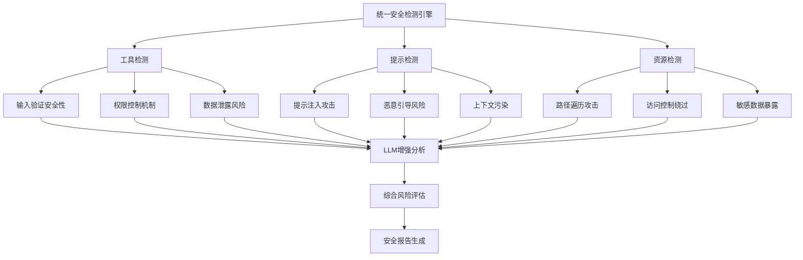

### 双重检测模式

项目设计了主动扫描和被动监控两种检测模式，形成了完整的安全检测体系。这种双重模式的设计确保了安全检测的全面性和实时性。

**主动扫描模式**：
- 用户主动触发的全面安全扫描
- 对MCP服务器进行深度安全分析
- 生成详细的安全报告和修复建议
- 支持自定义扫描范围和检测深度

**被动监控模式**：
- 实时监控MCP调用和交互
- 自动检测潜在的安全威胁
- 提供实时的安全警报和日志
- 支持历史记录和趋势分析

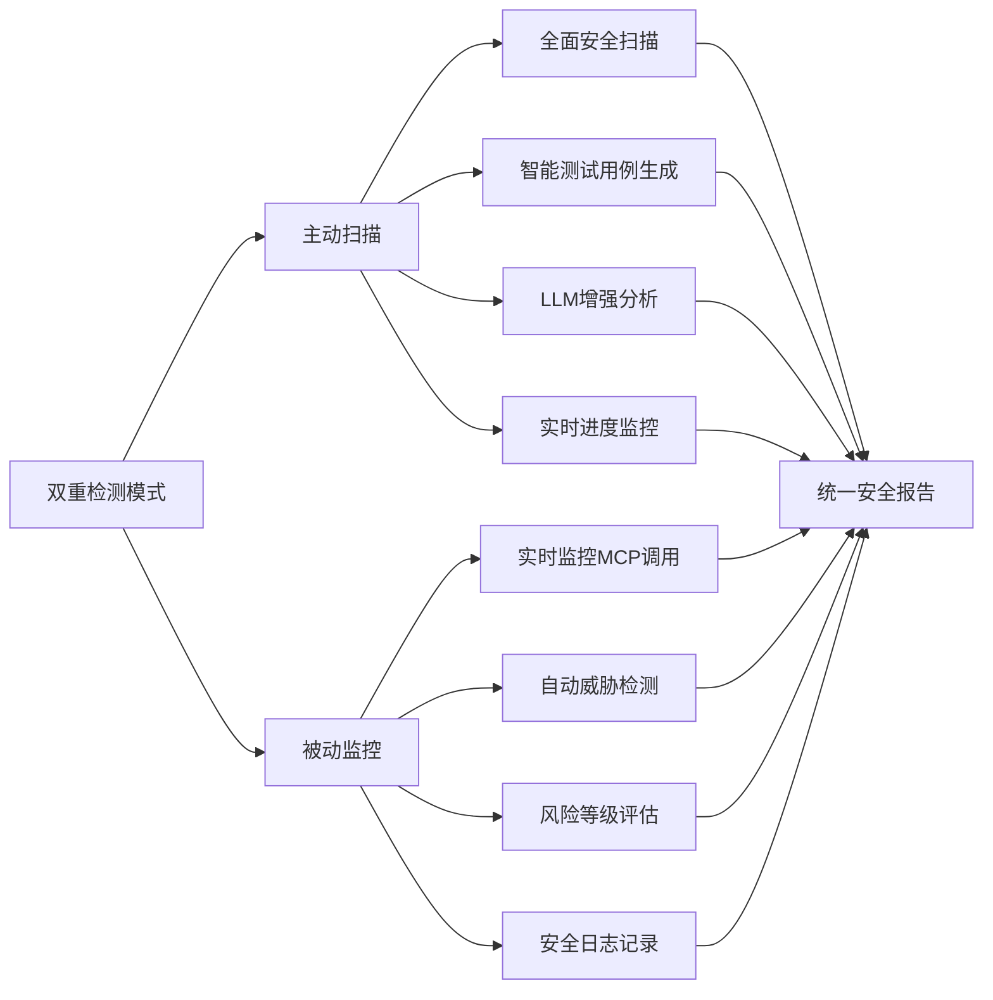

## 技术架构设计

### 整体架构

项目的技术架构采用分层设计，确保各模块职责清晰，便于维护和扩展。这种分层架构不仅提高了代码的可维护性，还为未来的功能扩展提供了良好的基础。

**架构层次说明**：

1. **UI层（React + Ant Design）**：负责用户界面的展示和交互，采用组件化设计，支持响应式布局
2. **状态管理层（Redux + LocalStorage）**：管理应用状态和数据持久化，确保数据的一致性和可靠性
3. **服务层（MCP Client + Security Engine）**：封装核心业务逻辑，提供统一的API接口
4. **核心服务层**：包含MCP协议处理、安全检测引擎、规则检测引擎和LLM客户端
5. **外部API层**：与MCP服务器、LLM服务和本地存储进行交互

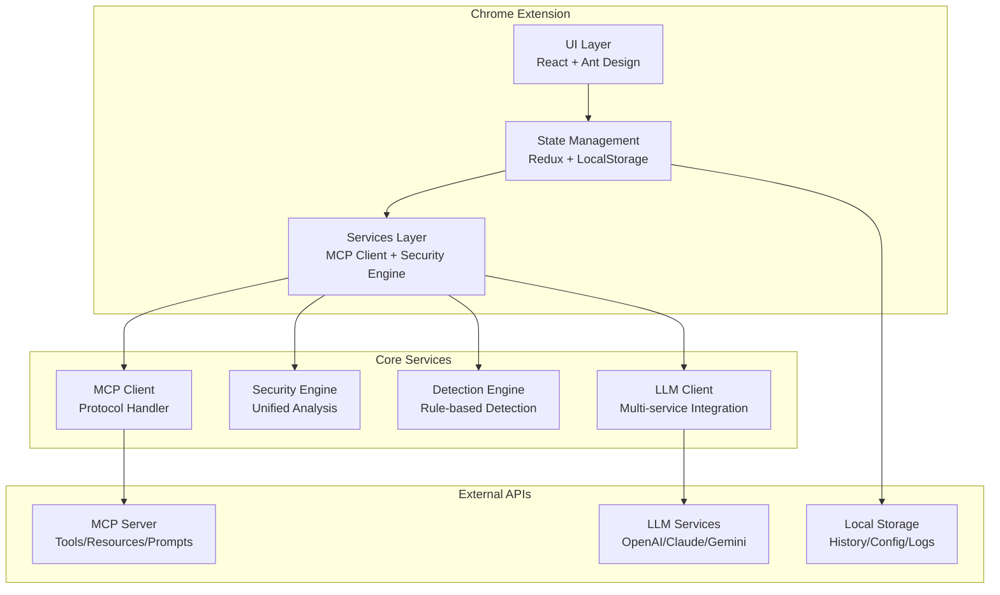

### 核心模块交互

各核心模块之间的交互关系体现了项目的设计思路和技术选型。通过清晰的模块划分和接口定义，确保了系统的可扩展性和可维护性。

**交互流程说明**：
1. **用户界面层**：接收用户操作，触发相应的业务逻辑
2. **安全引擎**：协调各个检测模块，执行统一的安全检测流程
3. **MCP客户端**：负责与MCP服务器的通信，获取组件信息和执行测试
4. **检测引擎**：基于规则进行威胁检测，提供实时的安全分析
5. **LLM客户端**：集成多种LLM服务，提供智能化的安全分析能力

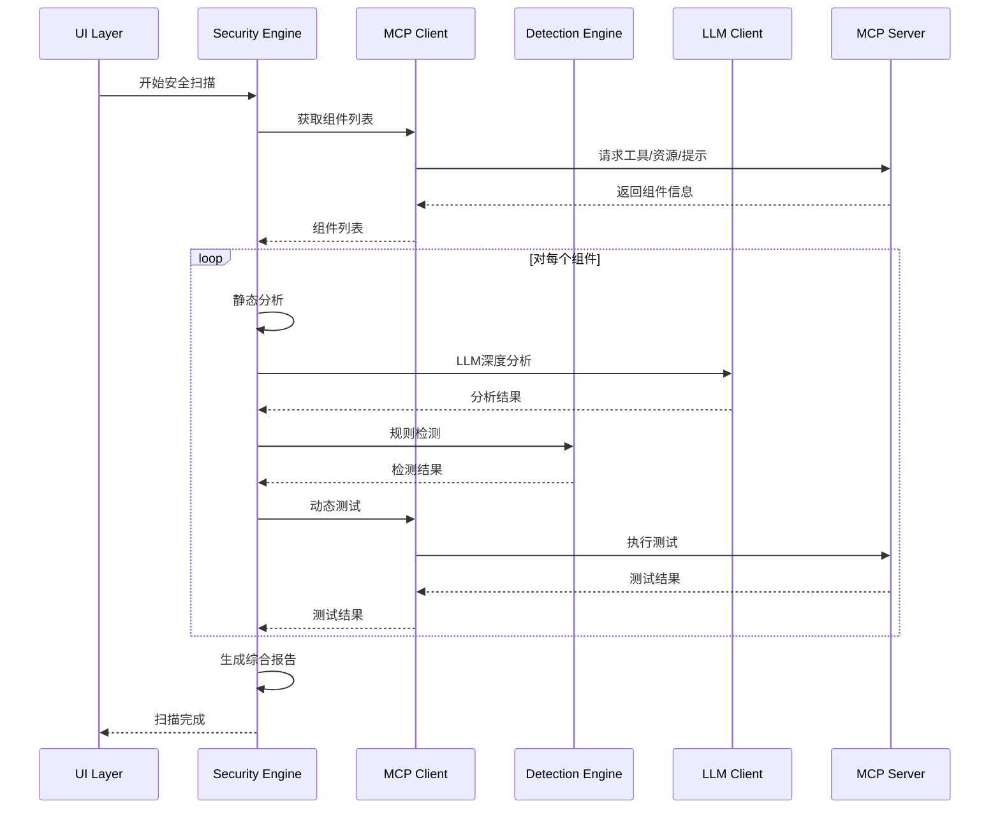

## 安全检测技术详解

### 统一检测流程

项目采用统一的检测流程，确保不同类型组件的检测结果具有一致性和可比性。这种统一流程不仅简化了检测逻辑，还提高了检测结果的可靠性。

**检测流程说明**：
1. **静态分析**：对组件定义进行初步分析，识别潜在的安全风险
2. **LLM深度分析**：使用大语言模型进行深度安全分析，提供智能化的安全评估
3. **规则检测**：基于预定义的安全规则进行威胁检测
4. **动态测试**：执行实际的安全测试，验证潜在漏洞
5. **风险评估**：综合各种检测结果，计算整体风险等级
6. **报告生成**：生成详细的安全报告和修复建议

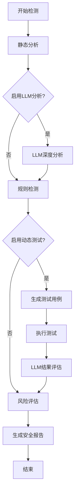

### 工具安全检测

工具检测是项目的核心功能之一，通过多维度分析确保MCP工具的安全性。工具作为MCP协议中最重要的组件，其安全性直接影响整个系统的安全水平。

**检测维度说明**：

1. **输入验证分析**：检查工具参数的验证机制，确保输入数据的安全性
2. **权限控制检查**：评估工具的权限控制机制，防止权限提升攻击
3. **数据泄露检测**：识别工具可能泄露的敏感信息
4. **注入攻击防护**：检测SQL注入、XSS、命令注入等常见攻击
5. **拒绝服务防护**：评估工具对资源消耗攻击的防护能力

**核心检测算法**：
```pseudocode
FUNCTION 工具安全检测(工具定义, 配置参数)
    // 初始化检测结果
    检测结果 = 初始化检测结果()
    
    // 静态分析阶段
    IF 启用静态分析 THEN
        静态分析结果 = 执行静态分析(工具定义)
        检测结果.合并(静态分析结果)
    END IF
    
    // LLM深度分析阶段
    IF 启用LLM分析 AND 配置了LLM服务 THEN
        LLM分析结果 = 调用LLM分析(工具定义, 安全分析提示词)
        检测结果.合并(LLM分析结果)
    END IF
    
    // 规则检测阶段
    IF 启用规则检测 THEN
        FOR EACH 规则 IN 启用的检测规则
            IF 规则.作用域 匹配 工具类型 THEN
                规则检测结果 = 执行规则检测(工具定义, 规则)
                检测结果.合并(规则检测结果)
            END IF
        END FOR
    END IF
    
    // 动态测试阶段
    IF 启用动态测试 THEN
        测试用例 = 生成测试用例(工具定义)
        FOR EACH 测试用例 IN 测试用例列表
            测试结果 = 执行动态测试(工具定义, 测试用例)
            检测结果.合并(测试结果)
        END FOR
    END IF
    
    // 综合风险评估
    最终风险等级 = 计算综合风险等级(检测结果)
    检测结果.设置风险等级(最终风险等级)
    
    RETURN 检测结果
END FUNCTION
```

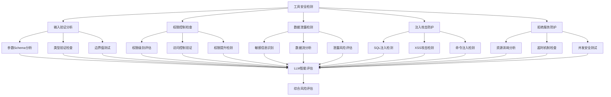

### 提示安全检测

提示检测针对AI模型的安全风险，确保提示内容不会导致安全漏洞。随着AI技术的广泛应用，提示安全已成为一个重要的安全领域。

**检测重点**：

1. **提示注入检测**：识别可能绕过AI模型安全边界的恶意提示
2. **角色操纵检测**：检测可能改变AI模型行为的角色定义
3. **上下文污染检测**：识别可能导致上下文污染的提示内容
4. **隐私泄露检测**：检测可能泄露敏感信息的提示
5. **恶意引导检测**：识别可能引导AI模型执行恶意行为的提示

**提示安全分析算法**：
```pseudocode
FUNCTION 提示安全检测(提示定义, 配置参数)
    // 初始化检测结果
    检测结果 = 初始化检测结果()
    
    // 提示注入检测
    IF 启用提示注入检测 THEN
        注入模式 = 识别注入模式(提示定义.内容)
        FOR EACH 模式 IN 注入模式
            IF 模式.风险等级 >= 中等 THEN
                检测结果.添加威胁(模式)
            END IF
        END FOR
    END IF
    
    // 角色操纵检测
    IF 启用角色操纵检测 THEN
        角色定义 = 提取角色定义(提示定义)
        IF 角色定义.包含危险关键词 THEN
            检测结果.添加威胁(角色操纵威胁)
        END IF
    END IF
    
    // 上下文污染检测
    IF 启用上下文污染检测 THEN
        上下文分析 = 分析上下文隔离(提示定义)
        IF NOT 上下文分析.隔离有效 THEN
            检测结果.添加威胁(上下文污染威胁)
        END IF
    END IF
    
    // LLM深度分析
    IF 启用LLM分析 THEN
        LLM分析结果 = 调用LLM分析(提示定义, 提示安全分析提示词)
        检测结果.合并(LLM分析结果)
    END IF
    
    // 综合风险评估
    最终风险等级 = 计算提示风险等级(检测结果)
    检测结果.设置风险等级(最终风险等级)
    
    RETURN 检测结果
END FUNCTION
```

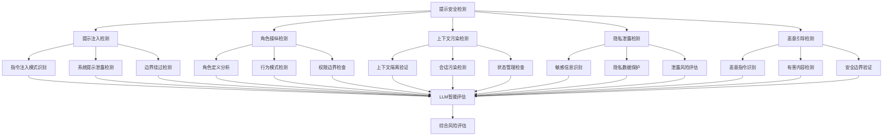

### 资源安全检测

资源检测确保MCP资源访问的安全性，防止路径遍历和敏感数据泄露。资源作为MCP协议中的重要组成部分，其安全性直接影响整个系统的数据安全。

**检测维度**：

1. **路径遍历检测**：识别可能绕过访问控制的路径遍历攻击
2. **访问控制检测**：验证资源的访问控制机制是否有效
3. **敏感数据检测**：识别可能泄露的敏感文件和数据
4. **内容注入检测**：检测资源内容中可能包含的恶意内容
5. **协议安全检测**：验证资源访问协议的安全性

**资源安全检测算法**：
```pseudocode
FUNCTION 资源安全检测(资源定义, 配置参数)
    // 初始化检测结果
    检测结果 = 初始化检测结果()
    
    // 路径遍历检测
    IF 启用路径遍历检测 THEN
        遍历测试用例 = 生成路径遍历测试用例()
        FOR EACH 测试用例 IN 遍历测试用例
            测试结果 = 执行路径遍历测试(资源定义, 测试用例)
            IF 测试结果.成功 THEN
                检测结果.添加威胁(路径遍历威胁)
            END IF
        END FOR
    END IF
    
    // 访问控制检测
    IF 启用访问控制检测 THEN
        权限测试 = 执行权限测试(资源定义)
        IF NOT 权限测试.通过 THEN
            检测结果.添加威胁(访问控制绕过威胁)
        END IF
    END IF
    
    // 敏感数据检测
    IF 启用敏感数据检测 THEN
        敏感模式 = 加载敏感数据模式()
        FOR EACH 模式 IN 敏感模式
            IF 资源定义.匹配模式(模式) THEN
                检测结果.添加威胁(敏感数据泄露威胁)
            END IF
        END FOR
    END IF
    
    // 内容安全检测
    IF 启用内容安全检测 THEN
        内容分析 = 分析资源内容(资源定义)
        IF 内容分析.包含恶意内容 THEN
            检测结果.添加威胁(内容注入威胁)
        END IF
    END IF
    
    // LLM深度分析
    IF 启用LLM分析 THEN
        LLM分析结果 = 调用LLM分析(资源定义, 资源安全分析提示词)
        检测结果.合并(LLM分析结果)
    END IF
    
    // 综合风险评估
    最终风险等级 = 计算资源风险等级(检测结果)
    检测结果.设置风险等级(最终风险等级)
    
    RETURN 检测结果
END FUNCTION
```

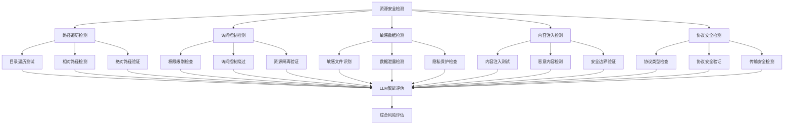

## 智能检测技术

### LLM增强分析

项目集成了多种LLM服务，通过AI技术提升安全检测的准确性和深度。LLM的引入不仅提高了检测的智能化水平，还为复杂的安全分析提供了新的可能性。

**LLM集成优势**：
- **深度理解**：LLM能够理解复杂的上下文和语义关系
- **智能推理**：基于大量训练数据，能够识别潜在的安全风险
- **自然语言处理**：能够处理自然语言描述的安全问题
- **持续学习**：随着模型更新，检测能力不断提升

**支持的LLM服务**：
- OpenAI GPT系列（GPT-3.5、GPT-4）
- Anthropic Claude系列
- Google Gemini系列
- 自定义Ollama服务
- 通用HTTP API接口

**LLM分析流程**：
```pseudocode
FUNCTION LLM安全分析(组件定义, 分析类型, LLM配置)
    // 构建分析提示词
    提示词模板 = 获取提示词模板(分析类型)
    分析提示词 = 构建分析提示词(组件定义, 提示词模板)
    
    // 选择LLM服务
    LLM服务 = 选择LLM服务(LLM配置)
    
    // 发送分析请求
    TRY
        分析结果 = LLM服务.发送请求(分析提示词)
        
        // 解析JSON结果
        IF 分析结果.格式 == "JSON" THEN
            解析结果 = 解析JSON结果(分析结果.内容)
        ELSE
            解析结果 = 解析文本结果(分析结果.内容)
        END IF
        
        // 验证结果有效性
        IF 验证结果有效性(解析结果) THEN
            RETURN 解析结果
        ELSE
            THROW 解析错误("LLM返回结果格式无效")
        END IF
        
    CATCH 错误
        记录错误日志(错误)
        RETURN 默认分析结果()
    END TRY
END FUNCTION
```

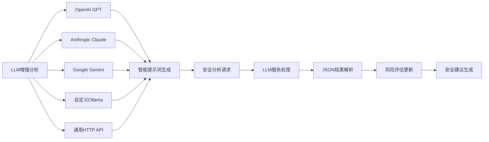

### 智能测试用例生成

通过LLM技术自动生成针对性的安全测试用例，提高检测的覆盖率和准确性。这种智能化的测试用例生成不仅提高了检测效率，还确保了测试用例的质量和针对性。

**测试用例生成策略**：
1. **基于组件定义**：分析组件的参数、功能和特性
2. **识别潜在风险点**：使用LLM识别可能的安全风险
3. **生成测试策略**：根据风险点制定相应的测试策略
4. **创建测试用例**：生成具体的测试用例和测试数据
5. **执行和评估**：执行测试用例并评估结果

**智能测试生成算法**：
```pseudocode
FUNCTION 智能测试用例生成(组件定义, 测试配置)
    // 分析组件特征
    组件特征 = 分析组件特征(组件定义)
    
    // 识别潜在风险点
    风险点列表 = LLM分析风险点(组件特征)
    
    // 生成测试策略
    测试策略 = 生成测试策略(风险点列表, 测试配置)
    
    // 创建测试用例
    测试用例列表 = []
    FOR EACH 策略 IN 测试策略
        测试用例 = 创建测试用例(策略, 组件定义)
        测试用例列表.添加(测试用例)
    END FOR
    
    // 执行测试用例
    测试结果列表 = []
    FOR EACH 测试用例 IN 测试用例列表
        测试结果 = 执行测试用例(测试用例, 组件定义)
        测试结果列表.添加(测试结果)
    END FOR
    
    // LLM结果评估
    IF 启用LLM评估 THEN
        评估结果 = LLM评估测试结果(测试结果列表)
        RETURN 评估结果
    ELSE
        RETURN 测试结果列表
    END IF
END FUNCTION
```

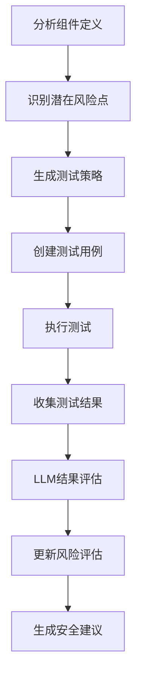

## 用户界面设计

### 多语言支持架构

项目采用完整的国际化设计，支持中英文双语，确保全球用户的使用体验。国际化设计不仅提高了产品的可用性，还为未来的多语言扩展奠定了基础。

**国际化设计特点**：
- **完整覆盖**：所有用户界面元素都支持多语言
- **动态切换**：支持运行时语言切换，无需重启应用
- **文化适配**：考虑不同文化的使用习惯和表达方式
- **扩展性强**：易于添加新的语言支持

**语言切换机制**：
```pseudocode
FUNCTION 切换语言(目标语言)
    // 验证语言支持
    IF NOT 支持的语言列表.包含(目标语言) THEN
        THROW 不支持的语言错误
    END IF
    
    // 加载语言包
    语言包 = 加载语言包(目标语言)
    
    // 更新应用状态
    应用状态.当前语言 = 目标语言
    应用状态.语言包 = 语言包
    
    // 更新本地存储
    本地存储.保存("当前语言", 目标语言)
    
    // 通知UI更新
    通知UI更新语言()
    
    RETURN 成功
END FUNCTION
```

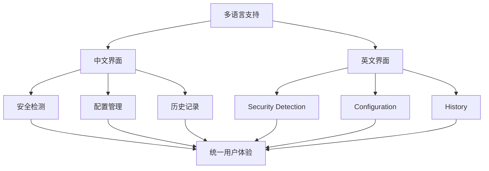

### 实时状态反馈

提供丰富的状态反馈机制，让用户实时了解检测进度和结果。这种实时反馈不仅提高了用户体验，还增强了用户对系统运行状态的了解。

**状态反馈机制**：
- **进度条显示**：实时显示检测进度百分比
- **状态消息**：显示当前正在执行的检测步骤
- **日志记录**：记录详细的检测过程和结果
- **错误提示**：及时显示检测过程中的错误信息

**状态管理算法**：
```pseudocode
FUNCTION 更新检测状态(状态信息)
    // 更新进度
    IF 状态信息.包含进度 THEN
        当前进度 = 状态信息.进度
        进度条.更新(当前进度)
    END IF
    
    // 更新状态消息
    IF 状态信息.包含消息 THEN
        当前消息 = 状态信息.消息
        状态显示.更新(当前消息)
    END IF
    
    // 记录日志
    IF 状态信息.需要记录 THEN
        日志系统.记录(状态信息)
    END IF
    
    // 检查错误
    IF 状态信息.包含错误 THEN
        错误处理.处理(状态信息.错误)
        用户界面.显示错误(状态信息.错误)
    END IF
    
    // 通知UI更新
    通知UI更新状态()
END FUNCTION
```

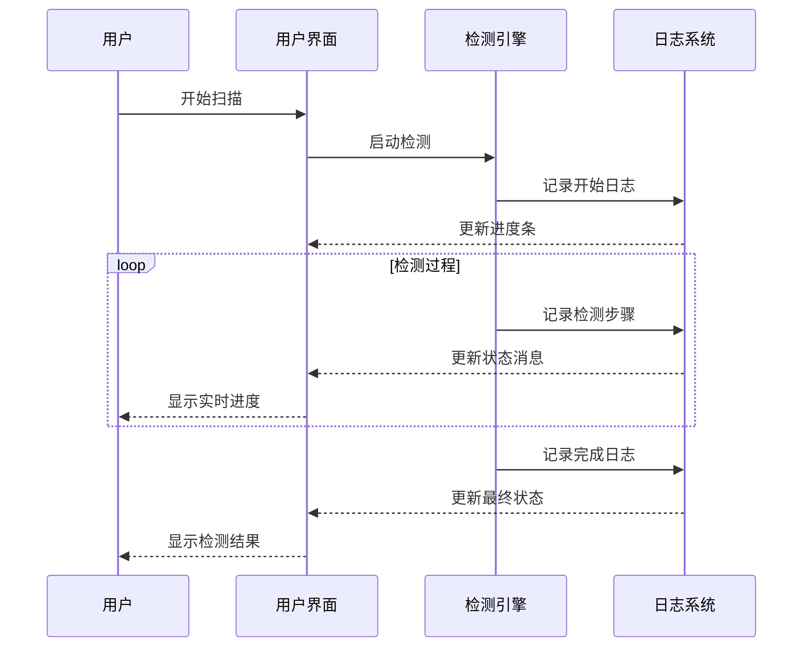

## 性能优化策略

### 检测引擎优化

通过多种技术手段优化检测引擎的性能，确保在大规模检测时的效率。性能优化不仅提高了用户体验，还降低了系统资源消耗。

**优化策略**：

1. **规则编译缓存**：预编译正则表达式，避免重复编译
2. **批量检测处理**：对多个组件进行批量检测，减少网络请求
3. **智能取消机制**：支持用户取消长时间运行的检测任务
4. **并发处理**：利用多线程技术提高检测效率
5. **内存优化**：合理管理内存使用，避免内存泄漏

**性能优化算法**：
```pseudocode
FUNCTION 优化检测引擎(检测配置)
    // 规则编译缓存
    IF 检测配置.启用规则缓存 THEN
        编译缓存 = 初始化编译缓存()
        FOR EACH 规则 IN 检测规则
            IF NOT 编译缓存.包含(规则) THEN
                编译结果 = 编译正则表达式(规则.模式)
                编译缓存.添加(规则, 编译结果)
            END IF
        END FOR
    END IF
    
    // 批量检测处理
    IF 检测配置.启用批量检测 THEN
        组件批次 = 分组组件(待检测组件, 批次大小)
        FOR EACH 批次 IN 组件批次
            并发执行检测(批次)
        END FOR
    END IF
    
    // 智能取消机制
    IF 用户请求取消 THEN
        停止所有检测任务()
        清理资源()
        RETURN 取消结果
    END IF
    
    RETURN 检测结果
END FUNCTION
```

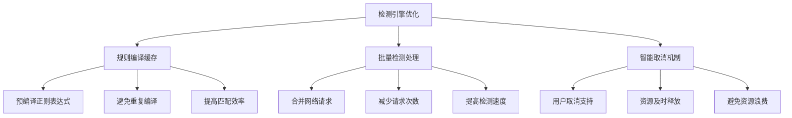

### 内存管理策略

通过合理的内存管理策略，确保长时间运行时的稳定性。内存管理是系统稳定性的重要保障，特别是在长时间运行和大量数据处理时。

**内存管理策略**：

1. **结果数量限制**：限制被动检测结果的数量，避免内存无限增长
2. **日志定期清理**：定期清理过期的安全日志，释放内存空间
3. **组件正确卸载**：确保组件卸载时正确清理事件监听器和定时器
4. **垃圾回收优化**：合理使用垃圾回收机制，避免内存泄漏

**内存管理算法**：
```pseudocode
FUNCTION 内存管理(系统状态)
    // 检查内存使用情况
    当前内存使用 = 获取内存使用量()
    
    // 结果数量限制
    IF 被动检测结果.数量 > 最大结果数量 THEN
        清理旧结果(被动检测结果, 保留数量)
    END IF
    
    // 日志定期清理
    IF 当前时间 - 上次日志清理时间 > 清理间隔 THEN
        清理过期日志(日志系统, 保留天数)
        上次日志清理时间 = 当前时间
    END IF
    
    // 内存使用监控
    IF 当前内存使用 > 内存阈值 THEN
        触发内存清理()
        记录内存警告(当前内存使用)
    END IF
    
    // 组件资源清理
    FOR EACH 组件 IN 已卸载组件
        清理组件资源(组件)
    END FOR
END FUNCTION
```

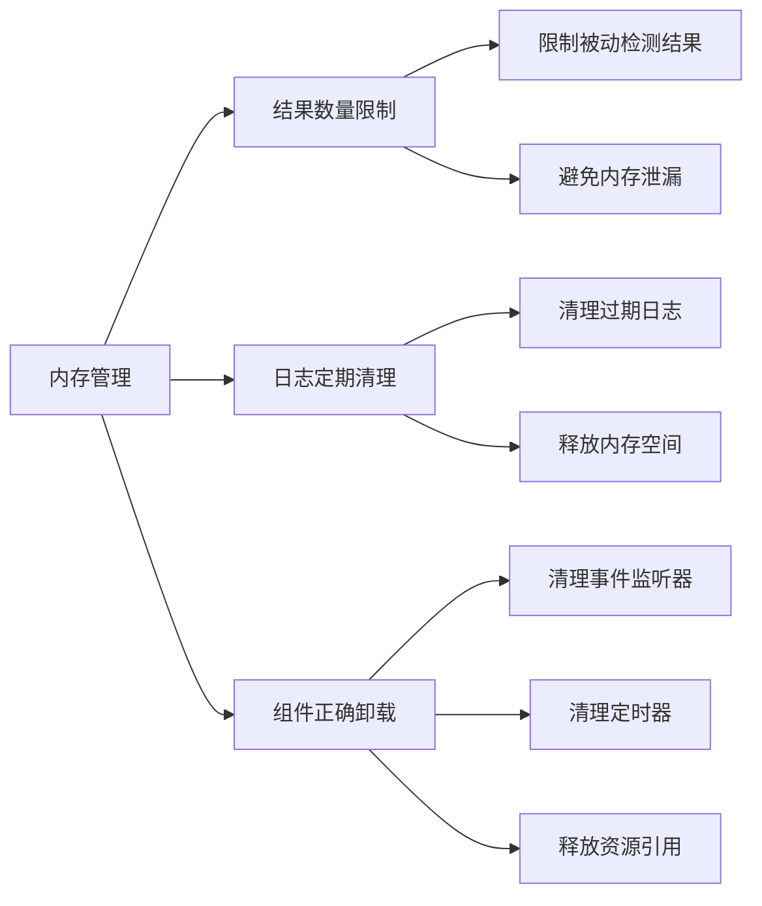

## 安全考虑

### 数据安全保护

项目在检测过程中高度重视数据安全，采用多种措施保护敏感信息。数据安全是系统设计的重要原则，确保用户数据不被泄露或滥用。

**数据安全措施**：

1. **敏感信息遮蔽**：自动识别和遮蔽检测到的敏感信息
2. **本地存储加密**：对本地存储的配置和历史记录进行加密
3. **传输安全保证**：使用HTTPS进行所有网络通信
4. **数据完整性验证**：确保数据在传输和存储过程中的完整性

**敏感信息遮蔽算法**：
```pseudocode
FUNCTION 遮蔽敏感信息(检测结果, 遮蔽配置)
    // 加载敏感信息模式
    敏感模式列表 = 加载敏感模式(遮蔽配置)
    
    // 遍历检测结果
    FOR EACH 结果项 IN 检测结果
        // 检查是否包含敏感信息
        FOR EACH 模式 IN 敏感模式列表
            IF 结果项.内容.匹配(模式) THEN
                // 应用遮蔽规则
                遮蔽内容 = 应用遮蔽规则(结果项.内容, 模式)
                结果项.内容 = 遮蔽内容
                结果项.标记为已遮蔽()
            END IF
        END FOR
    END FOR
    
    RETURN 检测结果
END FUNCTION
```

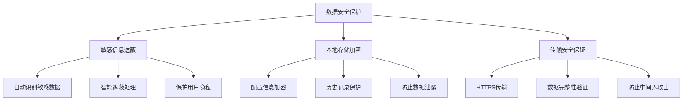

### 权限控制机制

采用最小权限原则，确保扩展的安全性。权限控制是Chrome扩展安全的重要保障，确保扩展只访问必要的资源。

**权限控制原则**：

1. **最小权限原则**：只请求必要的Chrome扩展权限
2. **用户确认机制**：重要操作需要用户明确确认
3. **审计日志记录**：记录所有安全相关操作
4. **权限动态管理**：根据实际需要动态调整权限

**权限控制算法**：
```pseudocode
FUNCTION 权限控制(操作类型, 操作参数)
    // 检查权限要求
    所需权限 = 获取操作权限要求(操作类型)
    
    // 验证当前权限
    IF NOT 验证权限(所需权限) THEN
        // 请求用户授权
        授权结果 = 请求用户授权(所需权限, 操作说明)
        IF NOT 授权结果.成功 THEN
            THROW 权限不足错误
        END IF
    END IF
    
    // 记录操作日志
    审计日志.记录(操作类型, 操作参数, 用户ID, 时间戳)
    
    // 执行操作
    TRY
        操作结果 = 执行操作(操作类型, 操作参数)
        审计日志.记录成功(操作结果)
        RETURN 操作结果
    CATCH 错误
        审计日志.记录失败(错误)
        THROW 错误
    END TRY
END FUNCTION
```

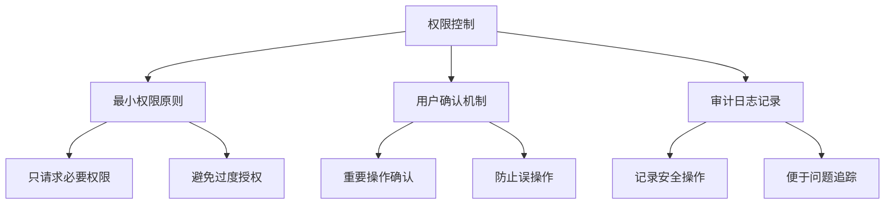

## 扩展性和可维护性

### 模块化设计

项目采用模块化设计，确保代码的可维护性和扩展性。模块化设计是现代软件工程的重要原则，有助于提高代码质量和开发效率。

**模块化设计原则**：

1. **高内聚低耦合**：每个模块内部功能紧密相关，模块间依赖关系简单
2. **单一职责**：每个模块只负责一个特定的功能领域
3. **接口清晰**：模块间通过明确的接口进行通信
4. **可替换性**：模块可以独立替换和升级

**模块化架构**：
```pseudocode
// 服务层接口定义
INTERFACE SecurityService
    FUNCTION 执行安全检测(组件定义) RETURNS 检测结果
    FUNCTION 获取检测历史() RETURNS 历史记录列表
    FUNCTION 更新检测规则(规则列表) RETURNS 更新结果
END INTERFACE

// 具体实现
CLASS SecurityEngine IMPLEMENTS SecurityService
    FUNCTION 执行安全检测(组件定义)
        // 实现具体的检测逻辑
        RETURN 检测结果
    END FUNCTION
    
    FUNCTION 获取检测历史()
        // 实现历史记录获取逻辑
        RETURN 历史记录列表
    END FUNCTION
    
    FUNCTION 更新检测规则(规则列表)
        // 实现规则更新逻辑
        RETURN 更新结果
    END FUNCTION
END CLASS
```

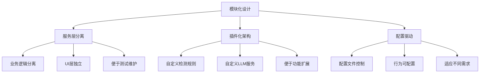

### 代码质量保证

通过多种技术手段确保代码质量。代码质量是项目成功的重要保障，直接影响系统的稳定性、可维护性和可扩展性。

**质量保证措施**：

1. **TypeScript类型安全**：使用TypeScript确保编译时类型检查
2. **单元测试覆盖**：关键模块配备完整的单元测试
3. **代码规范遵循**：使用ESLint和Prettier确保代码风格一致
4. **代码审查**：建立代码审查机制，确保代码质量

**测试框架示例**：
```pseudocode
// 单元测试示例
TEST SecurityEngine.执行安全检测
    // 准备测试数据
    测试组件 = 创建测试组件()
    期望结果 = 创建期望结果()
    
    // 执行测试
    实际结果 = SecurityEngine.执行安全检测(测试组件)
    
    // 验证结果
    ASSERT 实际结果.风险等级 == 期望结果.风险等级
    ASSERT 实际结果.威胁数量 == 期望结果.威胁数量
    ASSERT 实际结果.检测时间 < 最大检测时间
END TEST

// 集成测试示例
TEST 完整检测流程
    // 准备测试环境
    测试服务器 = 启动测试服务器()
    测试配置 = 创建测试配置()
    
    // 执行完整流程
    检测结果 = 执行完整检测流程(测试服务器, 测试配置)
    
    // 验证流程完整性
    ASSERT 检测结果.状态 == "完成"
    ASSERT 检测结果.包含所有组件类型
    ASSERT 检测结果.报告格式正确
END TEST
```

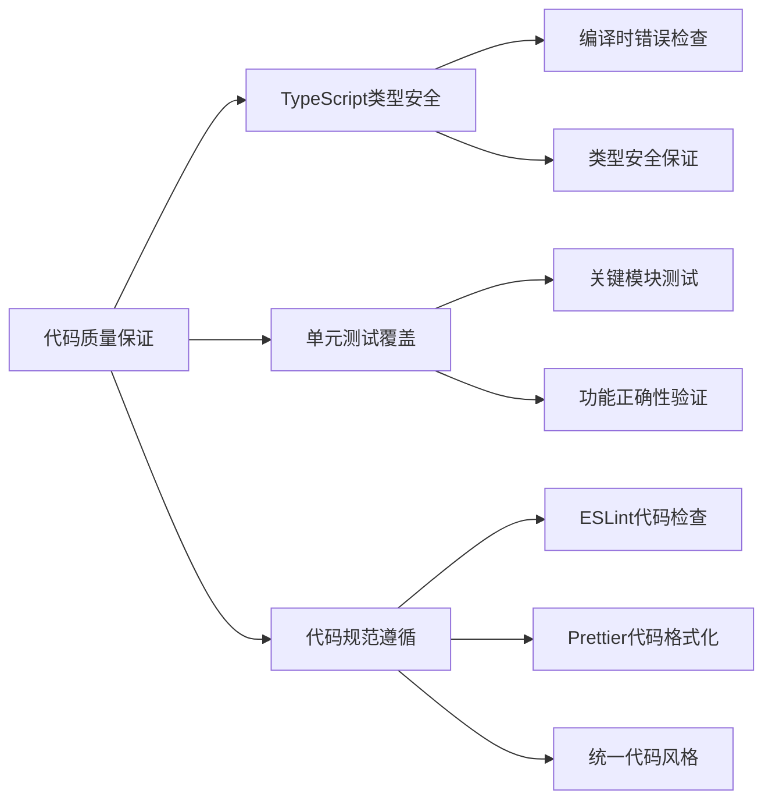

## 未来发展方向

### 功能扩展计划

项目将继续扩展功能，满足不断发展的安全需求。功能扩展是项目持续发展的重要驱动力，需要紧跟技术发展趋势和用户需求变化。

**扩展方向**：

1. **更多检测类型**：支持更多MCP组件类型的安全检测
2. **机器学习集成**：集成机器学习算法进行智能威胁检测
3. **云服务集成**：支持云端威胁情报和分布式检测
4. **可视化增强**：提供更丰富的图表和可视化报告
5. **移动端支持**：开发移动端应用，提供随时随地检测能力

**功能扩展路线图**：
```pseudocode
// 功能扩展规划
FUNCTION 规划功能扩展(当前版本, 目标版本)
    // 短期目标 (3-6个月)
    短期功能 = [
        "增强LLM分析能力",
        "添加更多检测规则",
        "优化用户界面体验",
        "完善文档和教程"
    ]
    
    // 中期目标 (6-12个月)
    中期功能 = [
        "集成机器学习算法",
        "支持云端威胁情报",
        "添加可视化报告",
        "开发移动端应用"
    ]
    
    // 长期目标 (1-2年)
    长期功能 = [
        "构建安全生态平台",
        "支持多协议检测",
        "实现智能安全助手",
        "建立安全社区"
    ]
    
    RETURN 功能扩展计划
END FUNCTION
```

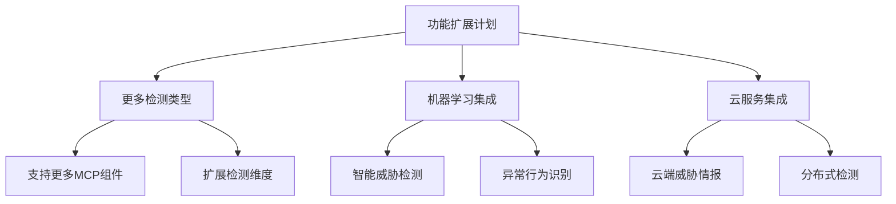

### 性能优化方向

通过新技术提升检测性能和用户体验。性能优化是项目持续改进的重要方面，直接影响用户的使用体验和系统的可扩展性。

**优化方向**：

1. **WebAssembly应用**：使用WebAssembly提升检测性能
2. **并行处理支持**：支持多线程并行检测
3. **缓存优化策略**：智能缓存检测结果和规则
4. **网络优化**：优化网络请求和响应处理
5. **内存优化**：进一步优化内存使用和管理

**性能优化策略**：
```pseudocode
// 性能优化规划
FUNCTION 规划性能优化(当前性能指标)
    // 检测性能优化
    IF 平均检测时间 > 目标时间 THEN
        优化策略.添加("WebAssembly重写核心算法")
        优化策略.添加("并行处理支持")
        优化策略.添加("智能缓存机制")
    END IF
    
    // 内存使用优化
    IF 内存使用量 > 目标内存 THEN
        优化策略.添加("内存池管理")
        优化策略.添加("垃圾回收优化")
        优化策略.添加("数据结构优化")
    END IF
    
    // 网络性能优化
    IF 网络延迟 > 目标延迟 THEN
        优化策略.添加("请求合并")
        优化策略.添加("连接池管理")
        优化策略.添加("压缩传输")
    END IF
    
    RETURN 优化策略
END FUNCTION
```

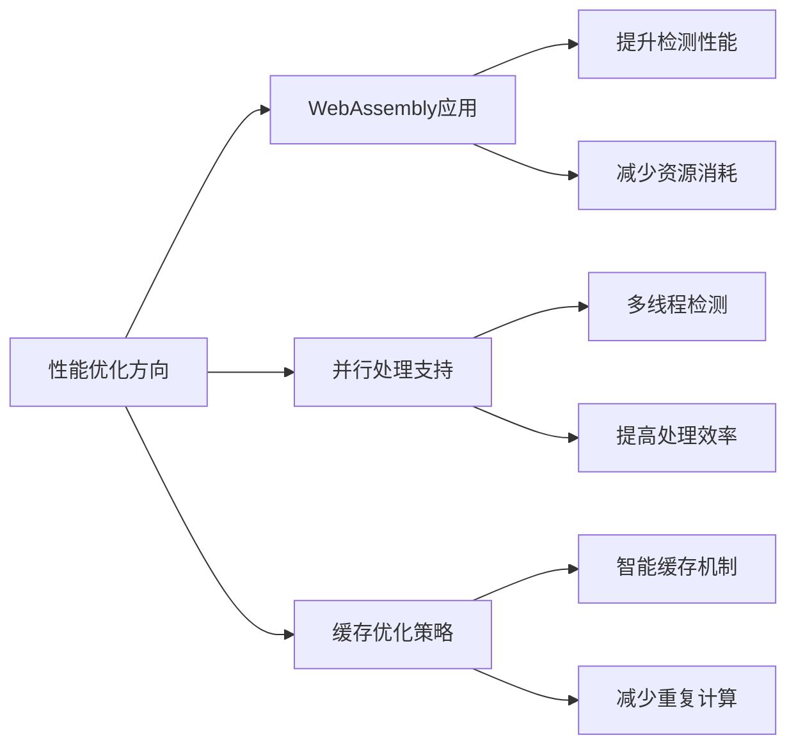

## 总结

MCP Security Inspector 是一个功能完整、技术先进的MCP协议安全检测工具。通过统一的安全检测引擎、双重检测模式、LLM增强分析等核心技术，为MCP协议生态提供了全面的安全保障。

### 项目亮点

1. **技术创新**：首次将LLM技术应用于MCP协议安全检测，开创了智能安全检测的新模式
2. **架构先进**：采用现代化的分层架构和模块化设计，确保了系统的可扩展性和可维护性
3. **功能全面**：支持工具、提示、资源三种MCP组件的全面安全检测
4. **用户体验**：提供直观的用户界面和丰富的状态反馈，确保良好的用户体验
5. **安全可靠**：采用多种安全措施，确保检测过程的安全性和用户数据的隐私保护

### 技术价值

项目在技术层面具有重要的价值：

- **填补空白**：为MCP协议生态提供了首个专业的安全检测工具
- **技术示范**：展示了如何将AI技术应用于安全检测领域
- **标准制定**：为MCP协议安全检测建立了标准化的检测框架
- **生态贡献**：为MCP协议生态的安全建设做出了重要贡献

### 发展前景

随着MCP协议的不断发展和AI技术的快速演进，MCP Security Inspector 将继续发挥重要作用：

- **技术演进**：随着LLM技术的进步，检测能力将不断提升
- **生态扩展**：随着MCP协议生态的扩大，应用场景将更加丰富
- **标准化推动**：项目的发展将推动MCP协议安全检测的标准化
- **社区建设**：将吸引更多开发者参与，形成活跃的开发者社区

---

*本文档详细介绍了MCP Security Inspector项目的技术架构、核心功能、实现原理和最佳实践，为开发者和使用者提供了全面的技术参考。项目通过创新的技术方案和先进的设计理念，为MCP协议生态的安全建设提供了强有力的支撑。* 